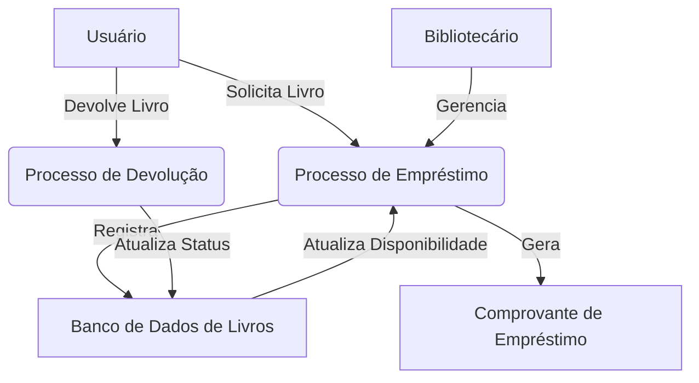
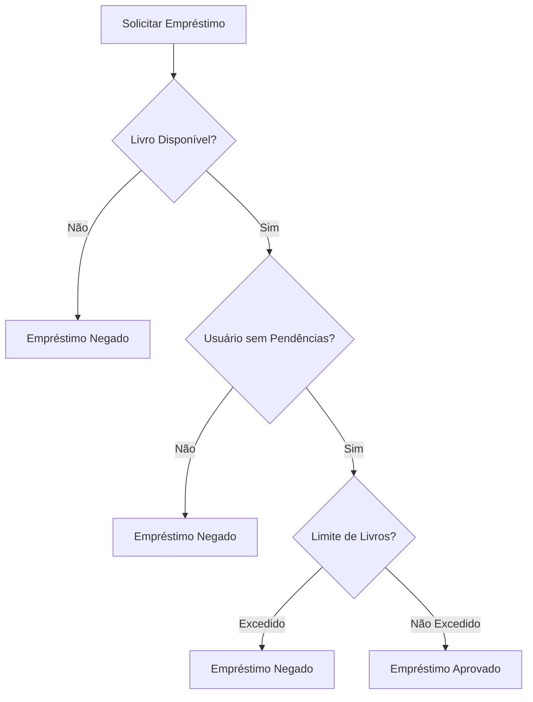

# Modelo Funcional em Análise de Sistemas
## Referência: [Sistema de Biblioteca Digital](https://github.com/rns-yoda/analise-sistemas/blob/main/aulas/anexos/diagramaclasse_biblioteca.md)

--- 

### 1. Introdução ao Modelo Funcional

#### O que é o Modelo Funcional?
O Modelo Funcional em Análise de Sistemas é uma abordagem focada na descrição e representação das funções e processos que compõem um sistema, independentemente da implementação ou tecnologia utilizada. Ele descreve **o que** o sistema faz, com ênfase nas transformações e fluxos de dados, ao invés de detalhar como esses processos são executados. Em vez de se concentrar nos componentes técnicos, esse modelo ajuda a entender a interação dos elementos e a dinâmica do sistema.

#### Objetivos no Sistema de Biblioteca Digital
No contexto de um **Sistema de Biblioteca Digital**, o Modelo Funcional visa:
- **Modelar as principais atividades** relacionadas à gestão de livros e usuários, como cadastro, empréstimos e devoluções.
- **Identificar fluxos de informações**, como o processo de solicitação e devolução de livros, desde o momento da requisição até o retorno à biblioteca.
- **Compreender as interações** entre os usuários e os bibliotecários, definindo responsabilidades e como os processos fluem entre essas partes.

---

### 2. Diagrama de Fluxo de Dados (DFD)

O **Diagrama de Fluxo de Dados (DFD)** é uma ferramenta fundamental na modelagem funcional, pois descreve visualmente o fluxo de informações entre os componentes do sistema. O DFD mostrado aqui reflete o **fluxo de dados** no processo de **empréstimo de livros**:



Esse diagrama mostra as interações entre:
- **Usuários** e **Bibliotecários** no processo de solicitação e gerenciamento de empréstimos.
- O **Banco de Dados de Livros** que armazena informações sobre os livros e suas disponibilidades.
- O **Comprovante de Empréstimo** gerado após a confirmação da operação.

---

### 3. Decomposição Funcional

A decomposição funcional do Sistema de Biblioteca Digital detalha as principais áreas de atividade e seus respectivos processos. No modelo funcional, cada uma dessas funções é desagregada em subprocessos, para representar o funcionamento do sistema de forma clara e precisa.

```
Gestão de Biblioteca
│
├── Gestão de Usuários
│   ├── Cadastrar Usuário
│   ├── Atualizar Dados
│   └── Autenticar Login
│
├── Gestão de Livros
│   ├── Cadastrar Livro
│   ├── Atualizar Informações
│   └── Gerenciar Categorias
│
└── Gestão de Empréstimos
    ├── Realizar Empréstimo
    ├── Renovar Empréstimo
    ├── Registrar Devolução
    └── Calcular Multas
```

Cada área de gestão (usuários, livros e empréstimos) envolve um conjunto de atividades essenciais para o bom funcionamento do sistema.

---

### 4. Especificação Funcional

A **especificação funcional** define de forma detalhada como uma função do sistema opera, com foco em entradas, processamento e saídas. O exemplo da função de **realizar empréstimo de livro** é detalhado abaixo:

#### Função: Realizar Empréstimo de Livro
- **Entrada**: 
  - Dados do Usuário (ex: identificação, histórico de pendências)
  - Identificação do Livro (ex: código, título)
  - Data do Empréstimo
- **Processamento**:
  - Verificação da disponibilidade do livro
  - Validação do cadastro do usuário
  - Registro do empréstimo no sistema
  - Atualização do status do livro
  - Definição da data de devolução
- **Saída**:
  - Comprovante de Empréstimo
  - Livro liberado para retirada
  - Notificação de prazo de devolução

---

### 5. Tabela de Decisão

A **tabela de decisão** descreve regras que determinam a ação a ser tomada com base em condições específicas. No caso de um **empréstimo de livro**, a tabela abaixo define as condições que devem ser atendidas para permitir ou negar o empréstimo:

| Condições                    | Regra 1 | Regra 2 | Regra 3 |
|------------------------------|---------|---------|---------|
| Livro Disponível             | Sim     | Sim     | Não     |
| Usuário sem Pendências       | Sim     | Não     | N/A     |
| Limite de Livros Não Atingido| Sim     | N/A     | N/A     |
| Ação: Permitir Empréstimo    | Sim     | Não     | Não     |

Essa tabela garante que os empréstimos só serão realizados se o livro estiver disponível, o usuário estiver em situação regular e o limite de livros não for ultrapassado.

---

### 6. Árvore de Decisão

A **árvore de decisão** é uma representação visual que facilita a análise dos processos de decisão. O fluxo para o processo de **empréstimo de livro** é representado da seguinte forma:



Esta árvore ajuda a visualizar as diferentes possibilidades e os resultados associados (aprovado ou negado) dependendo das condições analisadas.

---

### 7. Conclusão

#### Benefícios da Modelagem Funcional
- **Compreensão clara** dos processos, funções e fluxos de dados de um sistema.
- **Identificação precisa** de regras e interações, facilitando a comunicação entre analistas, desenvolvedores e usuários.
- **Base sólida** para o desenvolvimento do software, pois a modelagem funcional pode ser traduzida diretamente em especificações de implementação.

#### Aplicação no Sistema de Biblioteca Digital
- **Mapeamento completo** das funcionalidades do Sistema de Biblioteca Digital, desde a gestão de usuários até os processos de empréstimos e devoluções.
- **Definição clara de responsabilidades**, tanto para os usuários quanto para os bibliotecários, além dos processos envolvidos.
- **Facilitação do desenvolvimento e manutenção**, pois a modelagem funcional proporciona uma visão geral e detalhada dos processos que facilitam a implementação, testes e ajustes futuros no sistema.

