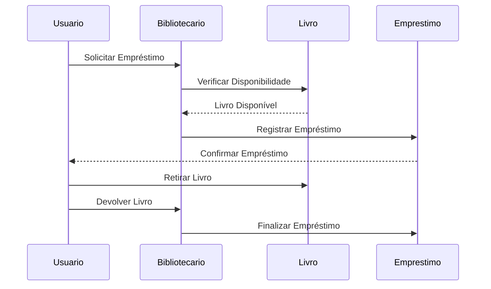
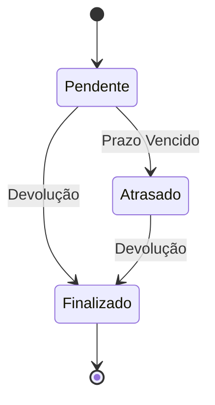
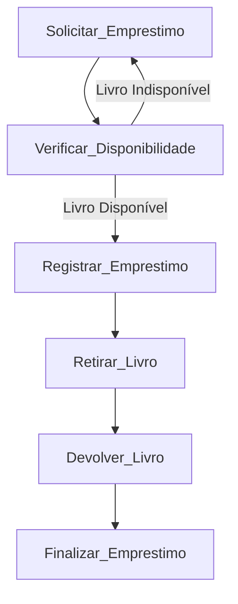

# Modelo Dinámico
Diferenciando de forma prática os conceitos de **eventos** e **estados** do [Sistema de Biblioteca Digital](https://github.com/rns-yoda/analise-sistemas/blob/main/aulas/anexos/diagramaclasse_biblioteca.md)
usando os três tipos de diagramas: **Diagrama de Sequência**, **Diagrama de Estados** e **Diagrama de Atividades**. 
Cada um deles ilustrará o fluxo do processo de **empréstimo de um livro**, incluindo como os eventos activam **transições de estados** e o **ciclo de vida das atividades**.

### 1. Diagrama de Sequência

Este diagrama ilustra o fluxo de eventos entre os participantes durante o processo de empréstimo de um livro. Ele mostra como o **usuário**, o **bibliotecário**, o **livro** e o **registro de empréstimo** interagem.

Neste diagrama, os eventos (ex.: *Solicitar Empréstimo*, *Devolver Livro*) desencadeiam ações entre os participantes, representando as mudanças ao longo do processo.

---

### 2. Diagrama de Estados

Este diagrama representa o **ciclo de vida de um empréstimo de livro**, mostrando os estados pelos quais o empréstimo pode passar e as transições entre esses estados com base em eventos específicos.

Aqui, temos:
- **Estados** como *Pendente*, *Atrasado* e *Finalizado*.
- **Eventos** que causam transições, como *Devolução* (mudando de *Pendente* para *Finalizado*) e *Prazo Vencido* (mudando de *Pendente* para *Atrasado*).

---

### 3. Diagrama de Atividades

Este diagrama mostra o **fluxo de atividades** do processo de empréstimo de um livro, desde a solicitação até a devolução, incluindo decisões baseadas na disponibilidade do livro.

No diagrama de atividades:
- Cada **atividade** (ex.: *Solicitar Empréstimo*, *Verificar Disponibilidade*) representa uma etapa do processo.
- As decisões (ex.: *Livro Disponível* ou *Livro Indisponível*) direcionam o fluxo para os próximos passos.

---

### Resumo dos Conceitos nos Diagramas

1. **Diagrama de Sequência**: Mostra a ordem dos **eventos** que levam ao empréstimo de um livro, detalhando a interação entre os participantes.
2. **Diagrama de Estados**: Representa os **estados** de um empréstimo e como **eventos** específicos mudam seu estado.
3. **Diagrama de Atividades**: Focaliza no **fluxo das atividades** no processo, desde a solicitação até a finalização do empréstimo.

Esses três diagramas ajudam a visualizar como eventos e estados interagem para completar o ciclo de vida do empréstimo de um livro em um sistema de biblioteca.