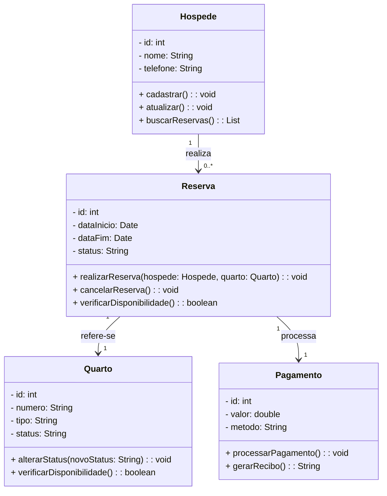
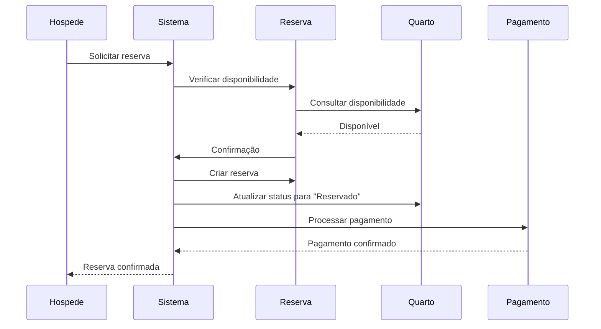
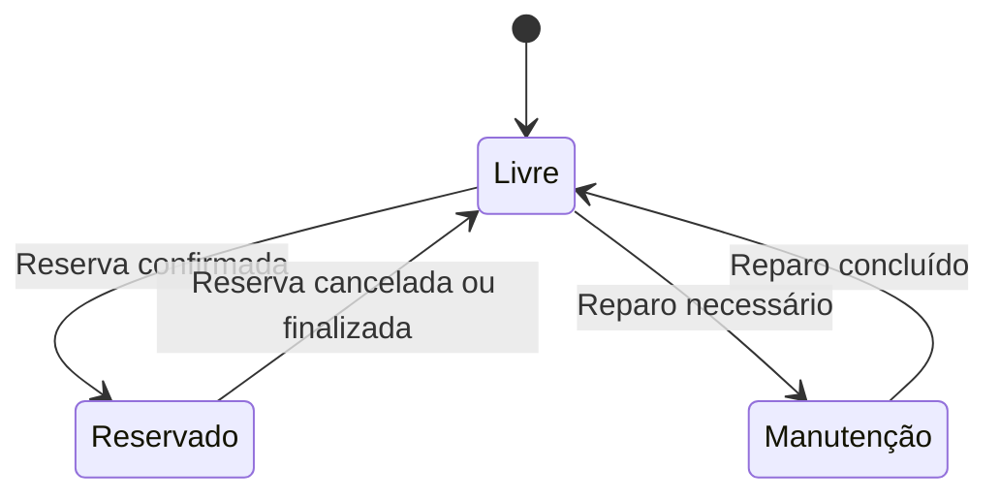
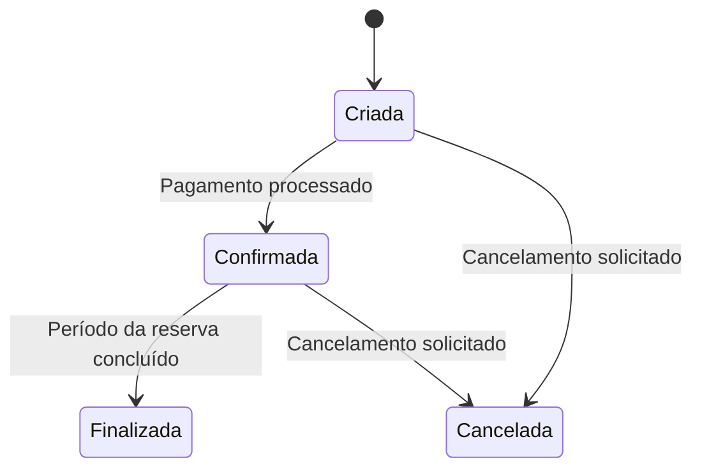
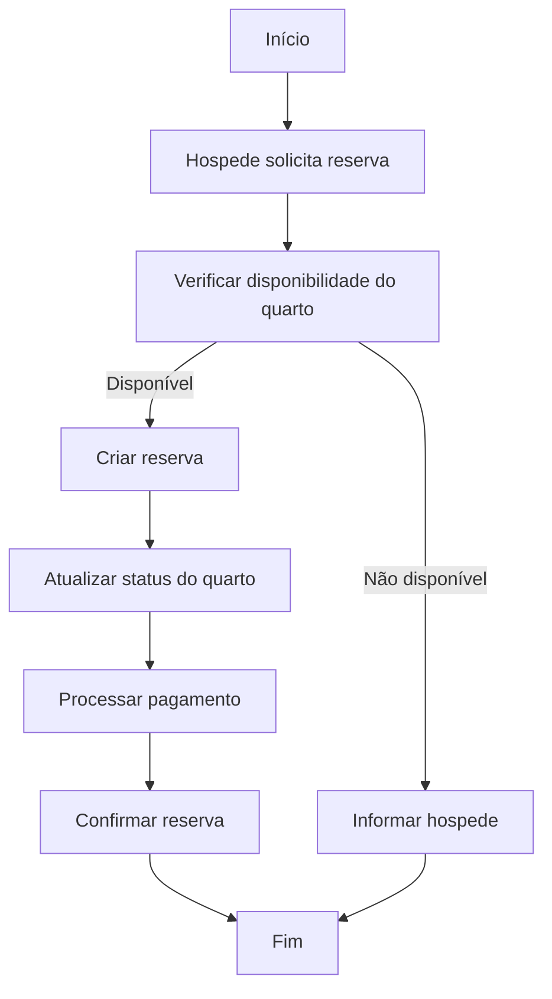

## SOLUÇÃO
Vamos modelar um [**Sistema Básico de Gerenciamento de Reservas de Hotel**](https://github.com/rns-yoda/analise-sistemas/blob/main/aulas/anexos/sistema_reserva_hotel.md) com quatro entidades principais. Essa modelagem abrange as seguintes entidades:

1. **Hospede**: Representa o cliente que realiza a reserva.
2. **Quarto**: Representa os quartos disponíveis para reserva.
3. **Reserva**: Representa o processo de reserva de um quarto por um hóspede.
4. **Pagamento**: Representa os detalhes do pagamento de uma reserva.

---

### **1. Diagrama de Classes**
Aqui está a estrutura básica das entidades e seus relacionamentos:

---

### **Explicação**
1. **Hóspede**  
   - Atributos:
     - `id`: Identificação única do hóspede.
     - `nome`: Nome do hóspede.
     - `telefone`: Contato do hóspede.  
   - Métodos:
     - `cadastrar()`: Registra um novo hóspede.
     - `atualizar()`: Atualiza informações do hóspede.
     - `buscarReservas()`: Lista as reservas feitas pelo hóspede.

2. **Quarto**  
   - Atributos:
     - `id`: Identificação única do quarto.
     - `numero`: Número do quarto.
     - `tipo`: Tipo do quarto (ex.: Standard, Luxo).
     - `status`: Status atual do quarto (ex.: Livre, Reservado).  
   - Métodos:
     - `alterarStatus()`: Modifica o status do quarto.
     - `verificarDisponibilidade()`: Retorna se o quarto está disponível para reserva.

3. **Reserva**  
   - Atributos:
     - `id`: Identificação única da reserva.
     - `dataInicio` e `dataFim`: Período da reserva.
     - `status`: Status da reserva (ex.: Ativa, Cancelada).  
   - Métodos:
     - `realizarReserva()`: Realiza uma nova reserva associada a um hóspede e a um quarto.
     - `cancelarReserva()`: Cancela a reserva.
     - `verificarDisponibilidade()`: Checa se o quarto está disponível no período solicitado.

4. **Pagamento**  
   - Atributos:
     - `id`: Identificação única do pagamento.
     - `valor`: Valor do pagamento.
     - `metodo`: Método de pagamento (ex.: Cartão, Dinheiro).  
   - Métodos:
     - `processarPagamento()`: Processa o pagamento da reserva.
     - `gerarRecibo()`: Gera um recibo de pagamento.

---

Vamos detalhar os diagramas para o fluxo de **Realização de Reserva** com os seguintes passos:  

1. O hóspede inicia o processo de reserva.
2. O sistema verifica a disponibilidade do quarto.
3. Caso disponível, a reserva é criada e o status do quarto é alterado para "Reservado".
4. O pagamento é processado.

---

### **1. Diagrama de Sequência**

---

### **2. Diagrama de Estado**

Representa as mudanças de estado do **Quarto** e da **Reserva** durante o processo:

#### **Estados do Quarto**
- **Livre** → Estado inicial quando está disponível.
- **Reservado** → Após a reserva ser confirmada.
- **Manutenção** → Caso precise de reparos ou esteja indisponível.

#### **Estados da Reserva**
- **Criada** → Reserva foi registrada, mas não confirmada.
- **Confirmada** → Reserva paga e válida.
- **Cancelada** → Reserva foi cancelada.

---

### **3. Diagrama de Atividades**

---

Nota: Esses diagramas cobrem as etapas principais do processo de realização de uma reserva.
