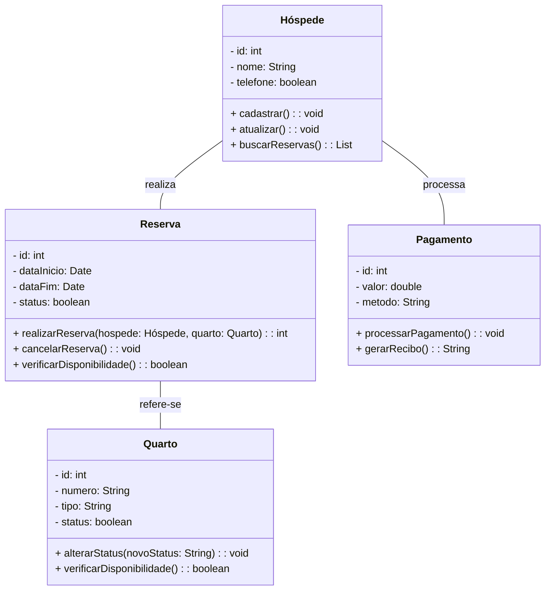

### **Levantamento de Requisitos: Sistema de Gerenciamento de Reservas de Hotel**

#### **Contextualização**
Um hotel busca modernizar e otimizar a gestão de suas operações, eliminando processos manuais, como o controle de reservas em planilhas e o acompanhamento de pagamentos por meio de registros em papel. Esses métodos têm gerado problemas como erros de alocação de quartos, dificuldades no controle de disponibilidade, falta de relatórios precisos sobre o status das reservas e atrasos no processamento de pagamentos.

Para resolver esses problemas, foi identificado a necessidade de um **Sistema de Gerenciamento de Reservas de Hotel**, que permitirá gerenciar hóspedes, quartos, reservas e pagamentos de forma integrada e eficiente.

---

### **Problemas Identificados**
1. **Erros de Alocação de Quartos**  
   - Quartos são reservados manualmente sem verificação automática de disponibilidade, resultando em conflitos entre hóspedes.
   
2. **Dificuldade no Controle de Disponibilidade**  
   - Não há um mecanismo claro para identificar rapidamente quais quartos estão livres, ocupados ou em manutenção.

3. **Gestão Ineficiente de Reservas**  
   - Falta de rastreamento do status das reservas, como reservas confirmadas, canceladas ou pendentes.

4. **Processamento Manual de Pagamentos**  
   - O controle financeiro é feito de forma descentralizada, dificultando o acompanhamento de pagamentos realizados e valores pendentes.

5. **Relatórios e Análises Ineficientes**  
   - A ausência de uma base de dados unificada impede a geração de relatórios para análise do desempenho do hotel.

---

### **Requisitos Funcionais**
1. **Gerenciamento de Hóspedes**  
   - Cadastrar, atualizar e buscar informações de hóspedes.
   - Permitir a consulta de reservas realizadas por um hóspede específico.

2. **Gerenciamento de Quartos**  
   - Cadastrar quartos com atributos como número, tipo (ex.: Standard, Luxo) e status (ex.: Livre, Reservado, Manutenção).  
   - Permitir verificar a disponibilidade de quartos em tempo real.  
   - Atualizar o status dos quartos automaticamente com base nas reservas.

3. **Gerenciamento de Reservas**  
   - Registrar uma reserva associando-a a um hóspede e um quarto.  
   - Permitir o cancelamento de reservas.  
   - Exibir o status de uma reserva (ex.: Criada, Confirmada, Cancelada).  
   - Garantir que dois hóspedes não possam reservar o mesmo quarto no mesmo período.

4. **Gerenciamento de Pagamentos**  
   - Registrar pagamentos com atributos como valor, método de pagamento e identificação da reserva associada.  
   - Processar pagamentos e gerar recibos automaticamente.  
   - Permitir consultar o histórico financeiro de reservas e gerar relatórios.

5. **Relatórios e Consultas**  
   - Gerar relatórios de ocupação de quartos, status das reservas e histórico financeiro.  
   - Exibir a lista de quartos disponíveis com base em critérios de consulta (ex.: tipo de quarto, período).

---

### **Requisitos Não Funcionais**
1. **Usabilidade**  
   - Interface simples e intuitiva para o cadastro de informações e a realização de consultas.

2. **Desempenho**  
   - Responder rapidamente às consultas sobre disponibilidade de quartos e relatórios financeiros.

3. **Escalabilidade**  
   - Suportar a expansão do número de quartos, hóspedes e reservas sem impactar a performance.

4. **Segurança**  
   - Proteger dados sensíveis, como informações pessoais de hóspedes e detalhes de pagamento.

---

### **Solução Proposta**
#### OBS: A solução contém alguns erros (propositados) para serem analisados

O sistema será modelado com quatro entidades principais:
1. **Hóspede**: Para cadastrar e gerenciar os clientes do hotel.
2. **Quarto**: Para controlar as informações e o status dos quartos.
3. **Reserva**: Para registrar e rastrear as reservas realizadas.
4. **Pagamento**: Para processar e gerenciar os pagamentos associados às reservas.

Esses modelos permitirão integrar todos os processos, reduzir erros, otimizar a experiência dos clientes e fornecer informações estratégicas para a gestão do hotel.
 

---

### **1. Diagrama de Classes**
Aqui está a estrutura básica das entidades e seus relacionamentos:

---
 
Vamos detalhar os diagramas para o fluxo de **Realização de Reserva** com os seguintes passos:  

1. O hóspede inicia o processo de reserva.
2. O sistema verifica a disponibilidade do quarto.
3. Caso disponível, a reserva é criada e o status do quarto é alterado para "Reservado".
4. O pagamento é processado.

---

### Solução do Exercício.
[Clicar aqui para ver a solução do exercício](https://github.com/rns-yoda/analise-sistemas/blob/main/aulas/anexos/sistema_reserva_hotel%20(SOLU%C3%87%C3%83O)%20.md)
